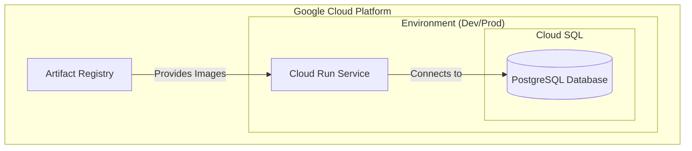

# infra.new Cloud Run, Postgres, GitHub template

## Project Description

This template provides a production-ready infrastructure setup for deploying applications on Google Cloud Platform (GCP) using Cloud Run and Cloud SQL (PostgreSQL). The infrastructure is defined using Terraform and supports multiple environments (development, production) with separate state management.

### Key Features

- Fully automated infrastructure deployment using Terraform
- Separate environment configurations (dev/prod) with isolated state management
- Managed PostgreSQL database using Cloud SQL
- Containerized application deployment using Cloud Run
- Artifact Registry for secure container image storage
- Infrastructure as Code (IaC) best practices

## Architecture



### Component Description

- **Artifact Registry**: Stores and manages container images securely within GCP
- **Cloud Run**: Serverless platform for running containerized applications
- **Cloud SQL**: Managed PostgreSQL database service
- **Multiple Environments**: Separate dev and prod environments with identical configuration but different resource allocations

## Quick Start Guide

### Prerequisites
- [Google Cloud SDK](https://cloud.google.com/sdk/docs/install)
- Terraform installed
- GCP account with billing enabled

### 1. Initial Setup
```bash
# Authenticate with Google Cloud
gcloud auth login --update-adc
```

### 2. Setting up Artifact Registry 📦

> This creates a central repository for your Docker images

1. Navigate to `infra/environments/artifacts/main.tf`
2. Update the following required values in the locals block:
   ```hcl
   billing_account_id = "YOUR_BILLING_ID"
   # Optional: org_id = "YOUR_ORG_ID"
   ```
3. Deploy the registry:
   ```bash
   cd infra/environments/artifacts
   terraform init
   terraform apply
   ```
4. ⚠️ **Important**: Save the `docker_repo_id` output for the next steps

### 3. Deploy Development Environment 🔧

1. Navigate to `infra/environments/dev/main.tf`
2. Update the configuration in the locals block:
   ```hcl
   billing_account_id = "YOUR_BILLING_ID"
   docker_repo_id    = "FROM_PREVIOUS_STEP"
   ```
3. Deploy the environment:
   ```bash
   cd infra/environments/dev
   terraform init
   terraform apply
   ```

> ⏱️ Deployment takes approximately 10 minutes

### 4. Deploy Production Environment 🚀

1. Navigate to `infra/environments/prod/main.tf`
2. Update the configuration in the locals block:
   ```hcl
   billing_account_id = "YOUR_BILLING_ID"
   docker_repo_id    = "FROM_PREVIOUS_STEP"
   ```
3. Deploy the environment:
   ```bash
   cd infra/environments/prod
   terraform init
   terraform apply
   ```

> ⏱️ Deployment takes approximately 10 minutes

### Troubleshooting 🔍

If you encounter permission issues:
1. Wait a few minutes for permission propagation and APIs to be enabled
2. Try running the terraform commands again
3. Verify your GCP authentication is current

